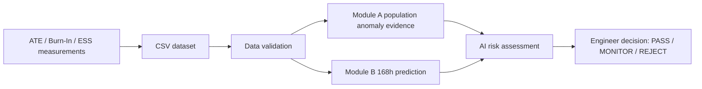

# HOPIUM_

HOPIUM is a prototype for AI-assisted anomaly detection and decision support during semiconductor component burn-in and screening, developed for Smart India Hackathon problem SIH26170. It includes a CSV-based screening pipeline, a local browser UI, engineer disposition recording, and a separate secondary-use assessment workflow for components an engineer rejects.

HOPIUM is not a production screening system, certification system, or authorization to use a component. Its risk results and secondary-use recommendations support engineering review; engineers remain responsible for decisions.

The datasets in this repository are synthetic. They are not real ISRO or industry data. Dataset reference limits are illustrative scenarios, not official component specifications. See [data/README.md](data/README.md).

## Current screening workflow



The repository accepts measurement data through CSV files. It does not include a direct ATE driver, live ATE stream, ESS control, or hardware integration. Input data uses lot and component identifiers and measurements for `Iddq`, `leakage_current`, and `propagation_delay` at `0h`, `24h`, `96h`, and `168h`.

- **Data validation** checks schema, provenance and data-quality rules. CSV-based screening validates before screening; a hard validation failure aborts that run.
- **Module A** identifies population-relative anomaly evidence from lot measurements. It does not itself decide whether a component is accepted or rejected.
- **Module B** predicts the `168h` target from `value_0h`, `value_24h`, and features derived from those early measurements. `value_96h` and `value_168h` are not production prediction inputs. The latter is the observed target used for evaluation and can be included in Secondary Use evidence.
- **AI risk** combines anomaly evidence, reference-limit breaches, predicted drift, predicted boundary crossings, and uncertainty. Risk levels (`LOW`, `MEDIUM`, `HIGH`) are advisory; they are not official engineering acceptance limits and do not set the engineer's disposition.
- **Engineer disposition** is recorded as `PASS`, `MONITOR`, or `REJECT`, with a required reason. This is separate from AI risk.

Model training and evaluation tools are also present. The Model Lab contains lot-level splitting and a production feature allowlist; its evaluation workflows are separate from running screening. The screening platform loads registered model artifacts and does not train or reselect models for each incoming lot.

## Secondary Use / Second-Life workflow

Secondary Use is a separate workflow that begins **only** when the existing engineer's final screening decision is `REJECT`:

```text
Engineer REJECT
  → Secondary-Use Pool
  → Component Evidence Profile
  → Application Profiles
  → Deterministic Compatibility Assessment
  → Rule-Based Recommendation
  → Engineer Review for a specific application
  → APPROVE or REJECT
  → Repurposed Component Register (APPROVE only)
  → Secondary-use audit / provenance
```

High AI risk, an anomaly, predicted drift, or a predicted boundary crossing does **not** put a component in the pool. The pool reads the engineer disposition from the existing screening `AuditRecorder`.

The evidence profile combines available source CSV measurements (including observed 0h, 24h, 96h, and 168h values), derived early delta and observed drift, Module A results, Module B predictions and intervals, risk context, and the original engineer disposition. Burn-in/ESS conditions, test environment, original application, and other unavailable facts are represented as unavailable or `null`; the workflow does not fill them with synthetic replacement values.

Application profiles are a small editable YAML catalogue in [data/applications/profiles.yaml](data/applications/profiles.yaml). It currently contains seven application classes. Bounds are marked `prototype-illustrative`, include provenance metadata, and are not claimed to come from NASA, IEC, an industry standard, or a component datasheet. The high-criticality profile requires lifetime evidence, which is unavailable in current source data and therefore evaluates as `UNKNOWN`.

Compatibility is requirement-by-requirement and deterministic:

| Result | Meaning |
| --- | --- |
| `PASS` | Available evidence satisfies that requirement. |
| `FAIL` | Available evidence conflicts with that requirement. |
| `UNKNOWN` | Required evidence is unavailable or cannot establish compatibility. It is not treated as a pass. |
| `CANDIDATE` | All assessed requirements pass; the profile may proceed to engineering review. It is not an authorization. |
| `INCOMPATIBLE` | At least one assessed requirement fails. |
| `INSUFFICIENT_EVIDENCE` | There is no decisive failure, but one or more required checks are unknown, or the profile has no requirements. |

The rule-based recommender returns application assessments with rationale, evidence references, provider/version, and timestamp. It does not override compatibility results or approve components. Engineer decisions apply to a specific component, assessment, and destination application. Only an engineer `APPROVE` for a `CANDIDATE` is added to the separate repurposed-component register. An engineer `REJECT` of an application assessment is audited but does not create a register entry.

Secondary-use records are separate from the original screening record. The register carries traceability to the assessment and original rejection reason; it does not rewrite the screening disposition. Additional testing is indicated by profiles, but recording test results or changing transfer status is not currently implemented.

### Secondary-use API

The local HTTP server exposes the following routes for a UI or integration:

| Method | Route | Description |
| --- | --- | --- |
| `GET` | `/api/secondary-use/pool` | List components with an explicit `REJECT` recorded in the active screening session. |
| `GET` | `/api/secondary-use/evidence/{lot_id}/{component_id}` | Get an eligible component's evidence profile. |
| `GET` | `/api/secondary-use/applications` | Get the YAML application catalogue. |
| `POST` | `/api/secondary-use/assess` | Create and persist an assessment. JSON body: `component_id`, `lot_id`, optional `application_ids` array. Omit `application_ids` to assess all profiles. |
| `GET` | `/api/secondary-use/assessments/{assessment_id}` | Retrieve a saved assessment, evidence snapshot, recommendations, and decisions. |
| `POST` | `/api/secondary-use/decision` | Record a candidate decision. JSON body: `assessment_id`, `application_id`, `decision` (`APPROVE` or `REJECT`), `reason`, `engineer_id`. |
| `GET` | `/api/secondary-use/register` | List approved secondary-use records. |
| `GET` | `/api/secondary-use/export_pool` | Download the current eligible pool as CSV. |
| `GET` | `/api/secondary-use/export_register` | Download approved register records as CSV. |

Assessment and register state is stored locally in `data/secondary_use/records.json`; secondary-use decision events are appended to the adjacent `.audit.jsonl` file. These are local file stores, not a database service.

The integrated browser UI uses these routes for the Reuse Pool, recommendations, evidence review, engineer decisions, and Repurposed Register. It shows unavailable source fields as unavailable. An approval creates a separate register record with `transfer_status: PENDING`; custody transfer and testing-result workflows are not implemented.

## Audit and persistence

The canonical screening `AuditRecorder` holds screening engineer decisions in memory for the running server session. The existing export operation can write a screening/audit CSV report, but the recorder itself does not restore its decisions after restart. Consequently, Secondary Use pool eligibility depends on the active screening session even though secondary-use assessments, decision events, and approved register entries are stored separately on disk.

Secondary-use audit events and screening audit exports are distinct. Secondary-use approval/rejection does not update the screening audit record. The current app has no authentication layer; an `engineer_id` submitted to the secondary-use API is caller-supplied and is not verified as an identity.

## Run the application

From the repository root, install the dependencies and start the existing local screening server:

```bash
python3 -m pip install -r requirements.txt
python3 scripts/run_screening_ui.py --port 8501
```

Open <http://127.0.0.1:8501>. The server opens a browser by default; use `--no-browser` in a headless environment. The UI includes screening, Model Lab and audit/export views, and Secondary Use Reuse Pool, Recommendations, Evidence Review, and Repurposed Register views.

The server defaults to the repository's demo CSV when `/api/current` is requested and no screening run has been loaded. The UI also allows selecting available repository CSV datasets.

### Windows launch

The UI uses Python's standard-library HTTP server and the same launch flow on Windows. In PowerShell, run these commands from the repository root:

```powershell
py -3 -m venv .venv
.\.venv\Scripts\Activate.ps1
python -m pip install -r requirements.txt
python scripts\run_screening_ui.py --port 8501
```

Open <http://127.0.0.1:8501> after the server starts. To avoid opening a browser automatically, add `--no-browser` to the final command. If PowerShell blocks activation, run the script directly with `py -3 scripts\run_screening_ui.py --port 8501` after installing the dependencies.

## Tests and validation tools

Run the test suite from the repository root:

```bash
pytest -v
```

Checkpoint verification on 2026-09-29: `pytest -q` completed with **175 passed**.

Validate a dataset using the existing Data Tester CLI (the `.meta.json` and ground-truth paths default from the CSV name when omitted):

```bash
python3 scripts/run_data_tester.py \
  --csv data/v2/demo_burnin_data.csv \
  --meta data/v2/demo_burnin_data.meta.json \
  --groundtruth data/v2/demo_burnin_groundtruth.json \
  --output-dir reports/
```

The validator aggregates findings from 13 validation categories; the number of individual findings can vary by dataset. Other available workflows include:

```bash
python3 scripts/run_module_b_evaluation.py
python3 scripts/run_model_lab.py
python3 scripts/generate_v2.py
```

The evaluation, training, and data generation scripts perform distinct operations. Review their arguments and configuration before using them on a dataset.

## Repository structure

```text
HOPIUM_sih26170/
├── AGENTS.md                     # Repository engineering and safety constraints
├── PROJECT_STATUS.md             # Project status notes
├── README.md
├── configs/                      # Risk, Model Lab, and synthetic generator YAML
├── data/
│   ├── applications/             # Secondary-use application profiles
│   ├── v2/                       # V2 synthetic datasets, metadata, ground truth
│   ├── *burnin_data.csv          # Demo and development datasets
│   └── README.md                 # Dataset provenance and usage notes
├── docs/                         # Product, architecture, data, ML, decisions, test plan
├── models/registered/            # Registered Module B model artifacts and metadata
├── reports/                      # Validation, evaluation, and exported reports
├── scripts/                      # UI server, validation, model, generation, analysis CLIs
├── secondary_use_AI/             # Secondary-use design/prototype artifacts
├── stitch_hopium_UI/             # Screening UI design artifacts
├── src/
│   ├── anomaly/                  # Module A anomaly detection and evidence
│   ├── audit/                    # Screening audit records and exporter
│   ├── data/                     # Synthetic data and validation
│   ├── evaluation/               # Metrics and evaluation reports
│   ├── model_lab/                # Features, training, evaluation, registry
│   ├── risk/                     # Module B prediction and dynamic risk engine
│   ├── screening/                # Pipeline, service, current HTML UI
│   └── secondary_use/            # Evidence, compatibility, recommendations, lifecycle
└── tests/unit/                   # Pytest unit and service-level workflow tests
```

## Limitations and status

- Data ingestion is CSV-based. Direct ATE, burn-in, or ESS equipment integration is not implemented.
- Repository datasets are synthetic and scenario limits are illustrative, not official specifications.
- Screening audit records are session-memory-only. The Secondary Use pool cannot reconstruct eligibility after a server restart without the canonical screening decision in the active session.
- Some source context—especially original application and burn-in/ESS conditions—is unavailable and remains unknown.
- Application profiles are illustrative. Compatibility is evidence screening for engineering review, not certification or proof of suitability for a real product.
- Engineer identifiers are caller-supplied and are not authenticated or role-verified. Screening decisions are session-memory-only, while secondary-use assessments, decisions, and register records are stored locally.
- The HTTP server and local JSON persistence are a prototype integration, not production deployment infrastructure. Authentication, multi-user concurrency handling, and controlled evidence/test-result management are not implemented.

## Project references

- [AGENTS.md](AGENTS.md): engineering constraints, including Module B input boundaries and synthetic-data rules.
- [docs/PRODUCT_SPEC.md](docs/PRODUCT_SPEC.md): problem context and product workflow.
- [docs/DATA_CONTRACT.md](docs/DATA_CONTRACT.md): dataset fields, timepoints, and schemas.
- [docs/ML_CONTRACT.md](docs/ML_CONTRACT.md): feature boundaries and evaluation constraints.
- [docs/ARCHITECTURE.md](docs/ARCHITECTURE.md): screening architecture and risk reasoning.
- [docs/TEST_PLAN.md](docs/TEST_PLAN.md): test strategy.
- [docs/DECISIONS.md](docs/DECISIONS.md): architectural decision records.
