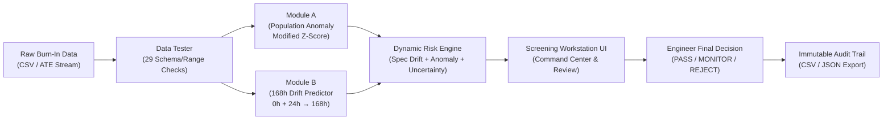

# HOPIUM_sih26170: AI-Driven Anomaly Detection in Component Burn-In & Screening

[](tests/)
[](https://www.python.org/)
[](docs/PRODUCT_SPEC.md)
[](LICENSE)

An industrial-grade, AI-driven screening and anomaly detection system for semiconductor burn-in testing, built for **Smart India Hackathon 2026 (Problem Statement SIH26170)**.

HOPIUM combines early-stage multivariate population outlier detection at 0h/24h with strict non-leaking trajectory prediction to forecast 168h parameter drift and quantify reliability risk, empowering quality engineers with actionable decision support and an immutable compliance audit trail.

---

## Key System Highlights

- **Strict Production Feature Boundary:** Module B regression consumes **strictly** `Value_0h` and `Value_24h` (and derived features like $\Delta_{24-0}$). `Value_96h` and `Value_168h` are strictly forbidden as input features during production inference.
- **Lot-Level Splitting & Locked Blind Test:** Prevents intra-lot leakage by partitioning datasets strictly at the `lot_id` boundary (60% Train / 20% Val / 20% Locked Blind Test). Model selection is driven exclusively by Validation MAE.
- **Separation of Advisory AI Risk & Human Decision:** AI produces advisory risk assessments (`LOW`, `MEDIUM`, `HIGH`) with grounded reasoning. Human quality engineers retain ultimate signoff authority (`PASS`, `MONITOR`, `REJECT`), with full override tracking in an immutable audit log.
- **Aerospace / ATE Dark-Themed Workstation UI:** Integrated single-page web workstation designed with Google Stitch ergonomics, featuring a 272px Command Rail, live oscilloscope trajectory visualizations, and zero heavy frontend dependencies.
- **Lean, Auditable Architecture:** Built on standard, auditable dependencies (`pandas`, `numpy`, `scikit-learn`, `pytest`) without unneeded database servers or heavy deep learning frameworks.

---

## End-to-End Operational Pipeline



---

## Development Phases & Quality Gates

The project follows a strict phase-gated progression. All phases have successfully satisfied their defined quality gates and verification criteria:

| Phase | Module / Milestone | Description & Deliverables | Quality Gate Status |
| :--- | :--- | :--- | :--- |
| **Phase 0** | **Contracts & Architecture** | Permanent specifications, ML feature boundaries, data contracts, and test plans established. | **PASSED** (100% doc consistency) |
| **Phase 1** | **Synthetic Data Engine** | Physics-informed trajectory generator across `0h, 24h, 96h, 168h` for `Iddq`, `leakage_current`, and `propagation_delay`. V1 baseline + V2 stochastic latent strength models. | **PASSED** (Seed-reproducible, provenance tagged) |
| **Phase 2** | **Data Tester & Validator** | Comprehensive engine running 29 structural, schema, range, monotonic, and statistical checks on incoming lots. | **PASSED** (Zero false negatives on corrupt data) |
| **Phase 3** | **Module B Model Lab** | Scikit-learn regression pipelines with residual-based uncertainty intervals. Strict lot-level splits with locked blind-test evaluation. | **PASSED** (Zero leakage of 96h/168h features) |
| **Phase 4** | **Module A Anomaly Engine** | Dynamic multivariate population anomaly detection using Modified Z-score (Iglewicz & Hoaglin) across lot distributions. | **PASSED** (Clean separation from static spec limits) |
| **Phase 5** | **Dynamic Risk Engine** | Evidence-based multi-factor risk assessment combining population anomaly, spec breach status, spec-normalized drift, and uncertainty. | **PASSED** (Deterministic advisory risk scoring) |
| **Phase 6** | **Core Screening Platform** | Unified `ScreeningPipeline` orchestrating data ingestion, validation, Module A, Module B, and Dynamic Risk Engine per lot. | **PASSED** (End-to-end execution without retraining) |
| **Phase 7** | **Human Audit & Export** | Human-in-the-Loop review system, override logging, and immutable audit trail with export to CSV/JSON. | **PASSED** (Full audit immutability & schema verified) |
| **Phase 8** | **Workstation UI & Integration** | Google Stitch-integrated Aerospace/ATE Dark-Themed screening workstation UI with REST API endpoints and full test suite verification. | **PASSED** (158/158 automated tests passing) |

---

## Core System Architecture & Modules

### 1. Module A: Dynamic Population Anomaly Detection
- Evaluates components relative to their manufacturing lot population at `0h` and `24h`.
- Employs **Modified Z-Score** ($M_i = \frac{0.6745 \cdot |x_i - \tilde{x}|}{\text{MAD}}$) to robustly detect population outliers without being skewed by extreme readings.
- Distinguishes between *within-spec population anomalies* and *hard specification breaches*.

### 2. Module B: Trajectory Prediction & Uncertainty Quantification
- Predicts `Value_168h` using strictly `Value_0h`, `Value_24h`, and $\Delta_{24-0}$.
- Features are strictly validated by data leakage tests (`tests/unit/test_module_b_features.py`).
- Produces $90\%$ prediction intervals ($[\hat{y} - 1.645 \cdot \sigma, \hat{y} + 1.645 \cdot \sigma]$) based on validation split residual distributions.

### 3. Dynamic Risk Engine
- Evaluates multi-factor risk without replacing human engineering judgment:
  - **Population Anomaly:** Detected via Module A Modified Z-Score.
  - **Specification Breach:** Current value exceeds component engineering limits.
  - **Dynamic Drift Assessment:** Predicted drift normalized against specification range ($\frac{|\Delta_{\text{pred}}|}{\text{Spec}_{\max} - \text{Spec}_{\min}}$).
  - **Uncertainty Envelope:** Width of prediction intervals relative to allowable drift margin.
- Assigns advisory risk levels: `LOW`, `MEDIUM`, or `HIGH`.

### 4. Human-in-the-Loop Review & Audit Trail
- Quality engineers evaluate flagged components and assign final dispositions: `PASS`, `MONITOR`, or `REJECT`.
- If an engineer's decision diverges from the AI advisory risk (e.g. `HIGH` risk overridden to `PASS`), the system mandates a documented engineering justification and flags the record with `STATUS: OVERRIDDEN`.
- All decisions, timestamps, session IDs, and feature values are recorded in an immutable audit log (`reports/phase7_audit_log.csv`).

---

## Screening Workstation UI

The user interface is hosted via Python's built-in HTTP server (`scripts/run_screening_ui.py`) and incorporates Google Stitch design guidelines:

```
┌─────────────────────────────────────────────────────────────────────────────┐
│ HOPIUM SIH26170  ■ Aero-Reliability Screening                               │
├──────────────┬──────────────────────────────────────────────────────────────┤
│ 00 IMPORT    │ 01 COMMAND CENTER                                            │
│ 01 COMMAND   │ ┌──────────────┬──────────────┬──────────────┬─────────────┐  │
│ 02 ANALYSIS  │ │ TOTAL: 240   │ LOW RISK: 198│ MED RISK: 24 │ HIGH: 18    │  │
│ 03 RISK      │ └──────────────┴──────────────┴──────────────┴─────────────┘  │
│ 04 AUDIT     │ 01.1 — LOT POPULATION TELEMETRY                               │
│ 05 MODEL LAB │ 01.2 — COMPONENT ATTENTION QUEUE                              │
│              ├──────────────────────────────────────────────────────────────┤
│              │ 02 COMPONENT ANALYSIS & OSCILLOSCOPE TRAJECTORIES            │
│              │ [Observed 0h->24h (Solid)]  ───> [Predicted 24h->168h (Dash)] │
│              │ ┌──────────────────────────────────────────────────────────┐ │
│              │ │ DECISION: [ PASS ] [ MONITOR ] [ REJECT ]                │ │
│              │ │ REASON: [ Required engineering justification... ]       │ │
│              │ │ [ CONFIRM DECISION ]                                     │ │
│              │ └──────────────────────────────────────────────────────────┘ │
└──────────────┴──────────────────────────────────────────────────────────────┘
```

- **00 IMPORT DATASET:** Repository dataset ingestion and live data quality validation report.
- **01 COMMAND CENTER:** Fleetwide telemetry KPI cards, lot-by-lot health matrix, and filtered component attention queue.
- **02 COMPONENT ANALYSIS:** Telemetry oscilloscope trajectory charts (0h-24h observed vs. 24h-168h predicted), spec limit references, evidence breakdown, and decision signoff controls.
- **03 RISK ANALYSIS:** Multi-parameter risk matrix, anomaly classifications, and uncertainty bounds.
- **04 AUDIT / EXPORT:** Live audit log review, override status tracking, and one-click CSV audit export.
- **05 MODEL LAB:** Offline model registry explorer displaying active artifacts, feature allowlists, and split configurations.

---

## Quick Start & Usage

### Prerequisites
- Python 3.10+
- Core packages: `pip install pandas numpy scikit-learn pytest pyyaml`

### 1. Launch the Screening Workstation UI
Start the local screening workstation web interface:
```bash
python3 scripts/run_screening_ui.py --port 8501
```
Open `http://127.0.0.1:8501` in your browser (or use `--no-browser` for headless environments).

### 2. Run the Full Automated Test Suite
Execute the comprehensive test suite (158 automated unit, feature leakage, risk engine, and pipeline tests):
```bash
pytest -v
```

### 3. Run Data Validation Quality Checks
Validate an incoming dataset against the 29 Phase 2 validation checks:
```bash
python3 scripts/run_data_tester.py \
  --csv data/v2/demo_burnin_data.csv \
  --meta data/v2/demo_burnin_data.meta.json \
  --output-dir reports/
```

### 4. Run Module B Model Lab Evaluation
Evaluate registered models against locked blind-test splits:
```bash
python3 scripts/run_module_b_evaluation.py
```

### 5. Generate Synthetic Burn-In Datasets
Generate reproducible V2 synthetic burn-in datasets with stochastic latent degradation:
```bash
python3 scripts/generate_v2.py
```

---

## Repository Structure

```text
HOPIUM_sih26170/
├── configs/                      # Pipeline, Model Lab & Generator YAML configurations
│   ├── model_lab_config.yaml
│   ├── synthetic_config.yaml
│   └── synthetic_config_v2.yaml
├── data/                         # Benchmark and development datasets
│   ├── demo_burnin_data.csv      # V1 canonical baseline dataset
│   └── v2/                       # V2 physics-informed burn-in datasets
├── docs/                         # Permanent specifications and ADRs
│   ├── AGENTS.md                 # Agent guidelines and engineering rules
│   ├── ARCHITECTURE.md           # System architecture & risk reasoning
│   ├── DATA_CONTRACT.md          # Parameter definitions and schemas
│   ├── DECISIONS.md              # Architectural Decision Records (ADRs 001-009)
│   ├── ML_CONTRACT.md            # Feature boundaries & Model Lab rules
│   ├── PRODUCT_SPEC.md           # Problem statement & operational workflow
│   └── TEST_PLAN.md              # Quality gates & verification plan
├── models/registered/            # Production model artifacts & registry metadata
│   ├── module_b_Iddq_v1/
│   ├── module_b_leakage_current_v1/
│   └── module_b_propagation_delay_v1/
├── reports/                      # Evaluation reports, validation logs & audit trails
│   ├── evaluation/               # Model Lab evaluation reports
│   └── phase7_audit_log.csv      # Immutable engineering audit log
├── scripts/                      # CLI runners and evaluation utilities
│   ├── generate_v2.py            # V2 synthetic dataset generator
│   ├── run_data_tester.py        # Data validation CLI
│   ├── run_model_lab.py          # Model Lab training & registration CLI
│   ├── run_module_b_evaluation.py# Locked blind-test evaluation runner
│   ├── run_risk_engine.py        # Standalone risk engine evaluator
│   └── run_screening_ui.py       # Screening Workstation web application
├── src/                          # Core source packages
│   ├── anomaly/                  # Module A: Population anomaly detector
│   ├── audit/                    # Phase 7: Audit recorder & CSV/JSON exporter
│   ├── data/                     # Ingestion & Phase 2 Data Tester
│   ├── evaluation/               # Evaluation metrics & report generators
│   ├── model_lab/                # Module B: Features, models, registry
│   ├── risk/                     # Phase 5: Dynamic Risk Engine
│   └── screening/                # Phase 6: ScreeningPipeline & Service orchestration
└── tests/unit/                   # Automated pytest suite (158 passing tests)
```

---

## Permanent Specifications & Documentation Links

- [AGENTS.md](AGENTS.md): Strict engineering guidelines and feature boundary constraints.
- [docs/PRODUCT_SPEC.md](docs/PRODUCT_SPEC.md): Problem context, objectives, and human-in-the-loop workflow.
- [docs/DATA_CONTRACT.md](docs/DATA_CONTRACT.md): Parameter definitions, timepoints, and synthetic data schemas.
- [docs/ML_CONTRACT.md](docs/ML_CONTRACT.md): Feature boundaries, lot splitting rules, and Model Lab criteria.
- [docs/ARCHITECTURE.md](docs/ARCHITECTURE.md): System architecture, dynamic risk reasoning, and ATE abstraction.
- [docs/TEST_PLAN.md](docs/TEST_PLAN.md): Testing strategy, quality gates, and blind-test lock checks.
- [docs/DECISIONS.md](docs/DECISIONS.md): Architectural Decision Records (ADRs 001–009).

---

## Phase-Gating Policy

*No production implementation for Phase $N+1$ begins until Phase $N$ has passed its defined quality gates, ensuring reproducible, high-integrity AI engineering throughout.*
